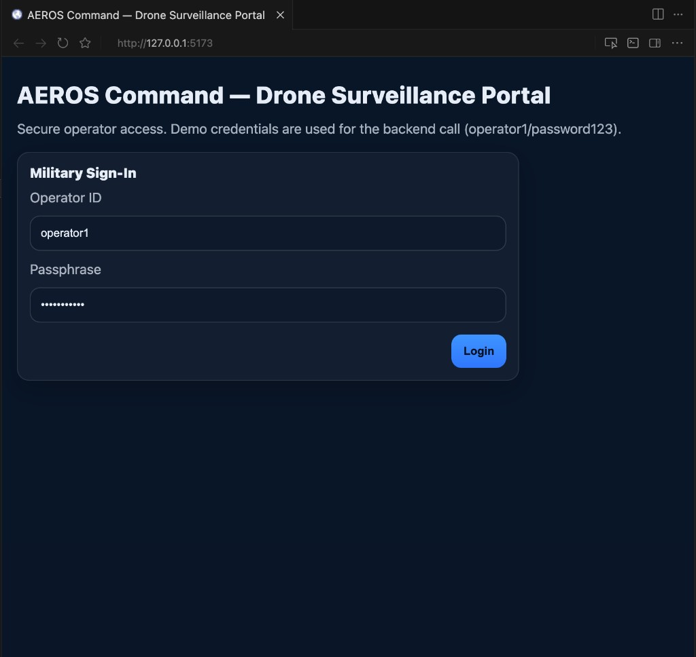
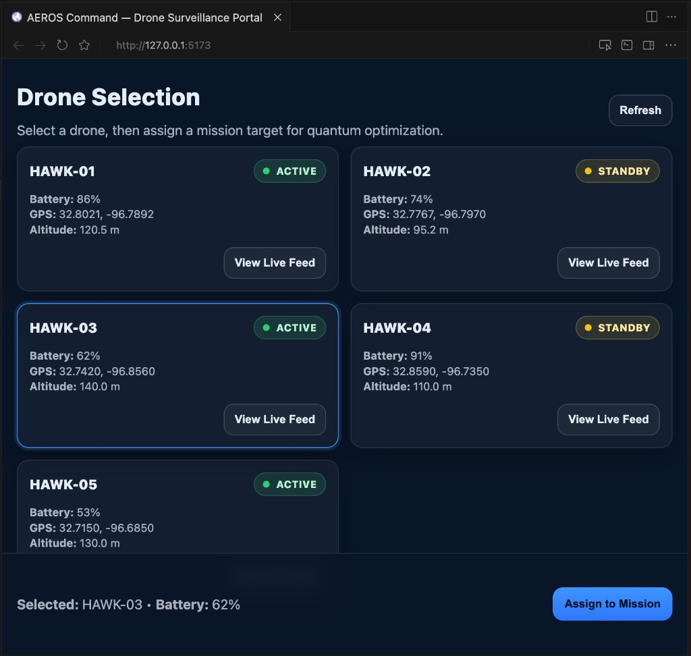
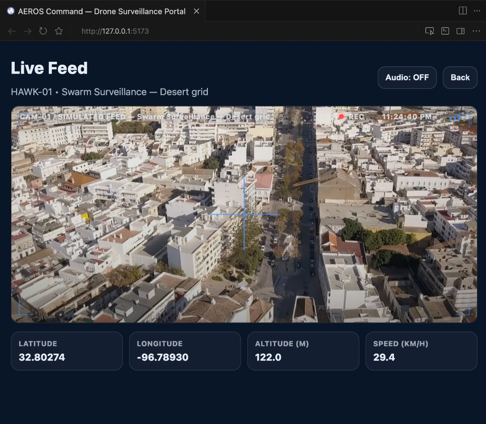
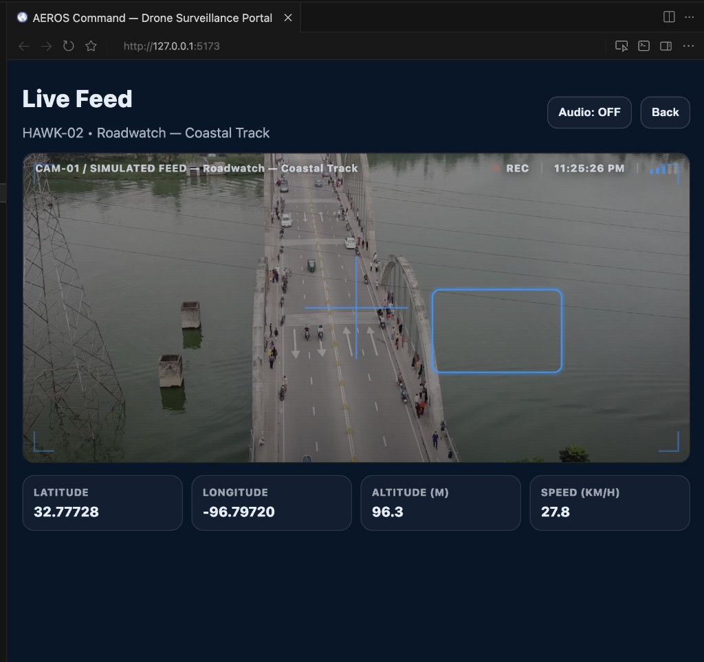
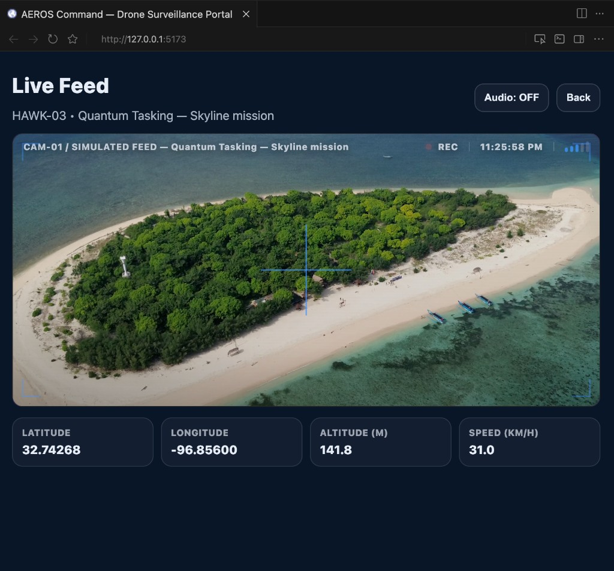
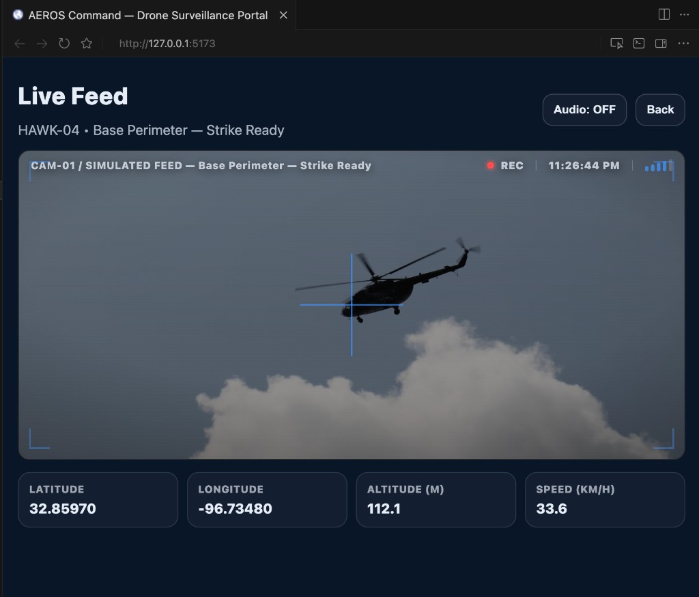
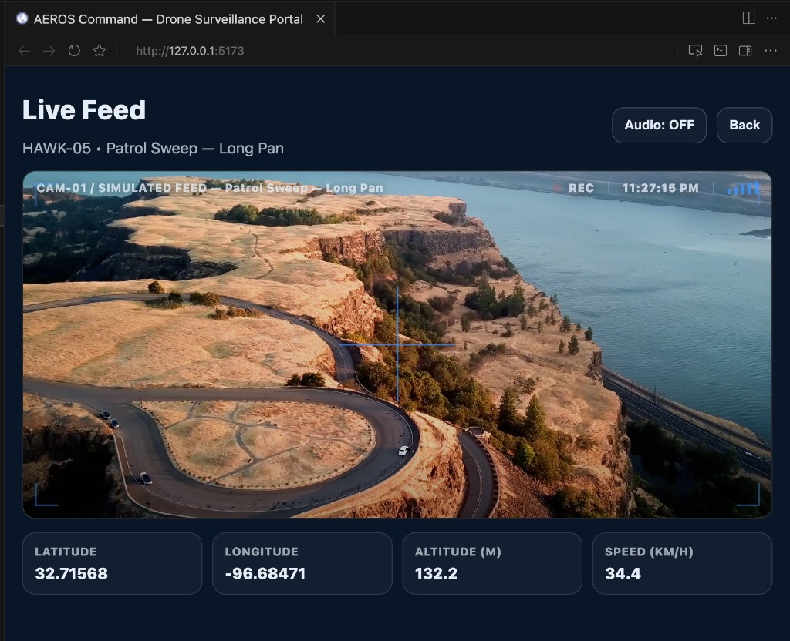

# qswarm — Quantum-Assisted Drone Mission Assignment (Full-Stack Demo)

**AEROS Command — Drone Surveillance Portal** · Local-first research demo combining a **Java REST API**, a **React** command UI, and a **Python / Qiskit** quantum-inspired optimizer.

---

## Abstract

**qswarm** is an end-to-end demonstration of how a **swarm-style surveillance control room** can be wired to a **discrete mission-assignment** backend. Five notional assets (**HAWK-01 … HAWK-05**) expose telemetry (GPS, altitude, battery, operational status). An operator authenticates against a **Spring Boot** service, reviews the fleet, requests **mission optimization** for a target coordinate, and inspects per-drone **simulated live feeds** with a tactical HUD.

The optimization core encodes “pick **one** drone” as a **one-hot combinatorial** problem and solves it with a **QAOA-style** workflow on **Qiskit Aer** (simulator), while the same codebase can report a **classical** optimum for comparison. The goal is **architectural**: show how quantum-native formulations plug into a conventional enterprise stack—not to claim a speedup for five drones, where classical search is trivial.

---

## What this project is about

| Theme | What you get in this repo |
|--------|---------------------------|
| **Operational story** | A notional **command portal** for multi-drone oversight: sign-in, fleet grid, live video feeds with telemetry overlays. |
| **Integration story** | Browser UI → **REST** → **Java** orchestration → **`quantum_optimizer.py`** via **`ProcessBuilder`** → parsed result back to UI. |
| **Quantum story** | **Mission assignment** as a **small QUBO / Ising-style** encoding: cost Hamiltonian + mixer + parameter search + Aer shots—mirroring patterns used in hybrid quantum–classical research. |

Nothing here requires cloud quantum hardware, paid APIs, or a database; the fleet is **in-memory** and videos are **local MP4** assets.

---

## Programming languages & formats

| Language / format | Where it is used |
|-------------------|------------------|
| **Java** (17) | Spring Boot backend: controllers, services, security filter, DTOs. |
| **Python** (3.10+ recommended) | `quantum_optimizer.py`: Qiskit circuits, Aer execution, CLI. |
| **JavaScript (ES modules) + JSX** | `drone-ui/src`: React components (`App.jsx`), hooks, `fetch` API calls. |
| **CSS** | `drone-ui/src/App.css`: layout, HUD, animations, responsive grid. |
| **HTML** | `drone-ui/index.html`: mount point for the SPA. |
| **XML** | `drone-backend/pom.xml`: Maven project definition. |
| **Markdown** | This README, `docs/presentation-qswarm-70min-slides.md`, `ieee_demo.ipynb` narrative cells. |
| **JSON** | REST request/response bodies; `package.json` / `package-lock.json`. |
| **Shell** | Run scripts in README; optional `scripts/export_presentation_docs.py` for exports. |

---

## Key technologies

### Backend

| Technology | Version (see repo) | Role |
|-------------|-------------------|------|
| **Spring Boot** | 3.3.x (`pom.xml`) | REST API, embedded Tomcat, validation. |
| **Java** | 17 | Implementation language. |
| **Maven** | (via wrapper or local install) | Build and `spring-boot:run`. |

### Quantum & numerics

| Technology | Role |
|-------------|------|
| **Qiskit** | Quantum circuits, `SparsePauliOp`, `PauliEvolutionGate`, `Statevector` / estimators. |
| **Qiskit Aer** | **`AerSimulator`**: shot-based sampling of the QAOA circuit. |
| **NumPy** | Arrays and classical numerics (pulled in with Qiskit; used in the optimizer script). |

### Frontend

| Technology | Version (see `package.json`) | Role |
|-------------|------------------------------|------|
| **React** | 18.x | UI state, screens, effects. |
| **Vite** | 5.x | Dev server (**`:5173`**), HMR, production bundling. |
| **`@vitejs/plugin-react`** | 4.x | JSX / Fast Refresh. |

### DevOps & assets

| Technology | Role |
|-------------|------|
| **Git / Git LFS** | Large **MP4** clips under `drone-ui/src/assets/videos/` are tracked with **Git LFS** (`.gitattributes`); clones may need `git lfs pull`. |

### Optional teaching artifact

| Artifact | Role |
|----------|------|
| **`ieee_demo.ipynb`** | Jupyter narrative: classical loop vs QAOA, timings, matplotlib chart—good for talks and coursework. |

---

## Why we chose a quantum (QAOA-style) approach here

1. **Problem shape** — Choosing the best drone for a mission is a **discrete decision** (which asset?). When you add **swarms, multiple targets, routing, and constraints**, the combinatorial structure is the same family of problems studied for **QAOA / QUBO** workflows.

2. **Honest teaching** — Implementing **Hamiltonian encoding**, **mixer layers**, and **Aer sampling** on real code teaches the **hybrid loop** (classical outer optimization over angles + quantum circuit evaluation) without hiding inside a black-box solver.

3. **Path to hardware** — The circuit structure used with **Aer** is the same *shape* you would later target on **superconducting** or other QPUs—after noise budgets, compilation, and calibration are addressed.

4. **Baseline comparison** — The script still exposes **classical** best-assignment on the same discrete model so we never confuse **“quantum demo”** with **“only possible solution.”**

---

## Quantum vs regular (classical) approach — what is the difference?

| Dimension | **Classical (“regular”)** approach | **Quantum (QAOA-style) approach** in this repo |
|-----------|-------------------------------------|-----------------------------------------------|
| **Representation** | Loops, sorting, argmin over explicit scores; or general-purpose **MIP/CP-SAT** solvers for larger models. | Same costs encoded into a **diagonal Hamiltonian** on qubits; **one-hot** invalid states penalized. |
| **Search dynamics** | Deterministic enumeration (tiny N) or heuristics (genetic, simulated annealing, branch-and-bound…). | **Variational** state: alternate **cost evolution** \(e^{-i\gamma H_C}\) and **mixer** \(e^{-i\beta H_M}\); tune \(\gamma,\beta\). |
| **Execution** | CPU evaluates arithmetic directly. | **Simulator** (Aer) evaluates **amplitudes / shots**; could move to **QPU** later. |
| **This repo at N = 5** | **Instant** and optimal for the toy model—**preferred** for latency. | **Heavier** (simulation + angle search) but demonstrates **end-to-end** pipeline and **scaling narrative**. |
| **Where quantum *research* often focuses** | Harder discrete cores after **classical preprocessing**. | Same: here we **isolate** the assignment core for pedagogy. |

**Takeaway:** For **five** drones, **classical wins on wall-clock**. The quantum track is here to show **how you would embed** quantum-native optimization in a **real software system**, not to claim faster wall time at this scale.

---

## What is implemented (detailed)

### 1) Backend — `drone-backend/` (Spring Boot 3, Java 17)

- **`POST /api/auth/login`** — JSON body `username` / `password`; demo **`operator1`** / **`password123`**; returns **`{ "token": "fake-jwt-token" }`**.
- **`GET /api/drones`** — Requires **`Authorization: Bearer fake-jwt-token`**; returns five drones with `id`, `name`, **`ACTIVE` / `STANDBY`**, `batteryPercentage`, `latitude`, `longitude`, `altitude`.
- **`POST /api/drones/optimize`** — Body **`targetLat`**, **`targetLon`**; runs **`python3 ../quantum_optimizer.py`** from the repo root via **`ProcessBuilder`**; parses stdout for **`Selected: HAWK-xx`** (and returns raw log text for the UI).
- **Security** — `FakeJwtAuthFilter`: lightweight bearer check; **OPTIONS** requests bypass auth so **CORS preflight** succeeds.
- **CORS** — Allows UI origins **`http://localhost:5173`** and **`http://127.0.0.1:5173`**.

### 2) Quantum optimizer — `quantum_optimizer.py` (Qiskit + Aer)

- Generates or uses a **five-drone** scenario (names **HAWK-01 … HAWK-05**), **Haversine** distance, **weighted** distance + battery cost.
- Builds **diagonal scores** for valid **one-hot** bitstrings; **invalid** patterns get a strong penalty.
- Expands diagonal to **`SparsePauliOp`** (Pauli-Z sum), **X-mixer**, **QAOA-style** layered circuit with **`PauliEvolutionGate`**.
- **Classical** angle search (grid / random per depth) using **`StatevectorEstimator`**; then **Aer** shots; decodes **valid** bitstrings to a drone index.
- **macOS / OpenMP note** — Script sets thread-related **environment variables** before imports to reduce **Aer / OpenMP** friction; Aer options request **single-thread** execution where supported.

### 3) Frontend — `drone-ui/` (React + Vite)

- **Screen 1 — Sign-in** — Calls login API; stores token in React state.
- **Screen 2 — Drone selection** — Loads fleet; card selection (blue outline); **Refresh**; **Assign to Mission** → optimize API → **modal** with selected drone + raw optimizer output.
- **Screen 3 — Live feed** — Per-drone **MP4** (`src/assets/videos/hawk-0x.mp4`); gradient backdrop per drone; **HUD** (CAM label, REC, time, signal bars); **crosshair** + corner brackets; **Ken Burns**-style motion on video; **HAWK-02** gets a **tracking box**; post-optimize **MISSION AREA** frame when viewing the selected drone; **Web Audio** ambience after **Audio ON** (user gesture); **STANDBY** drones use a dimmed video style.

---

## Applications & tools you need to run and test

Install these on your machine (versions are indicative—use **Java 17+**, **Node 18+**, **Python 3.10+** for smoothest experience):

| Tool | Why you need it |
|------|-----------------|
| **JDK 17** | Compile and run Spring Boot. |
| **Apache Maven** | `mvn spring-boot:run` in `drone-backend/`. |
| **Node.js + npm** | Install and run the Vite dev server for `drone-ui/`. |
| **Python 3 + pip** | Run `quantum_optimizer.py`; install **`qiskit`** and **`qiskit-aer`**. |
| **Modern browser** (Chrome, Edge, Firefox, Safari) | Exercise the UI; dev server on **port 5173**. |
| **Git** (+ **Git LFS** if cloning) | Clone repo; **LFS** pulls large **`.mp4`** assets. |
| **(Optional) Jupyter** | Open and run **`ieee_demo.ipynb`**. |

**Quick test flow**

1. Terminal A: `cd drone-backend && mvn spring-boot:run` → API on **`:8080`**.
2. Terminal B: `cd drone-ui && npm install && npm run dev` → UI on **`:5173`**.
3. Browser: open **`http://localhost:5173`** or **`http://127.0.0.1:5173`** (both allowed by CORS).
4. Login → select a drone → **Assign to Mission** → open **View Live Feed** on several HAWKs.
5. Optional: `python3 quantum_optimizer.py --target-lat 32.78 --target-lon -96.80` from repo root.

---

## Output screenshots (current UI)

Screenshots below are stored under **`docs/screenshots/`** and show the **AEROS Command** portal running locally (**`127.0.0.1:5173`** in these captures).

### 1) Sign-in — operator access



**What you see:** Military-themed sign-in card; operator ID and passphrase fields; **Login** posts to **`/api/auth/login`** and receives the demo bearer token used for subsequent API calls.

---

### 2) Drone selection — fleet grid and mission button



**What you see:** Title **Drone Selection**; instruction line for **quantum optimization**; **Refresh**; cards for **HAWK-01 … HAWK-05** with **ACTIVE** (green) / **STANDBY** (yellow), battery %, GPS, altitude; **View Live Feed** per card; one drone **selected** (blue outline); footer **Selected: …** and **Assign to Mission** (calls **`/api/drones/optimize`**).

---

### 3) Live feed — HAWK-01 (Swarm / desert grid)



**What you see:** Simulated aerial feed; HUD text **CAM-01 / SIMULATED FEED** with mission label; **REC** + timestamp + signal bars; crosshair; telemetry row (**latitude, longitude, altitude, speed**); **Audio** / **Back** controls.

---

### 4) Live feed — HAWK-02 (Roadwatch / coastal track + tracking box)



**What you see:** Same HUD pattern; **HAWK-02** includes an extra **blue tracking rectangle** over the scene (demo “target track” affordance).

---

### 5) Live feed — HAWK-03 (Quantum tasking / skyline mission)



**What you see:** Island / coastal simulated footage; labels reference **Quantum Tasking** / **Skyline mission** for narrative alignment with the quantum optimization story.

---

### 6) Live feed — HAWK-04 (Base perimeter / strike ready)



**What you see:** Helicopter / sky scene; **Base Perimeter — Strike Ready** labeling; same HUD + telemetry pattern.

---

### 7) Live feed — HAWK-05 (Patrol sweep / long pan)



**What you see:** Road / terrain aerial view; **Patrol Sweep — Long Pan**; consistent telemetry strip.

---

## Repository layout (high level)

```
qswarm/
├── README.md                 ← this file
├── quantum_optimizer.py      ← Qiskit + Aer CLI / optimizer
├── ieee_demo.ipynb           ← optional Jupyter walkthrough
├── drone-backend/            ← Spring Boot API
├── drone-ui/                 ← React + Vite SPA
│   └── src/assets/videos/    ← MP4 feeds (Git LFS)
├── docs/
│   ├── screenshots/          ← README figures (PNG)
│   └── presentation-qswarm-70min-slides.md
└── scripts/
    └── export_presentation_docs.py   ← optional MD → HTML/DOCX/PDF
```

---

## Run commands (copy-paste)

### Backend (port 8080)

```bash
cd drone-backend
mvn spring-boot:run
```

### UI (port 5173)

```bash
cd drone-ui
npm install
npm run dev
```

Open **`http://localhost:5173`** (or **`http://127.0.0.1:5173`**).

### Optimizer only (terminal)

```bash
python3 quantum_optimizer.py --target-lat 32.78 --target-lon -96.80
```

**Python deps (example):**

```bash
python3 -m pip install qiskit qiskit-aer
```

---

## Notes

- **Videos missing after clone?** Run **`git lfs pull`** (or install Git LFS before clone) so **`*.mp4`** files populate.
- **Audio in browser:** autoplay policies require a user click — use **Audio ON** on the live feed.
- **Credentials:** demo **`operator1`** / **`password123`** per backend contract.
- **ACTIVE vs STANDBY:** affects **badge color** and **feed dimming** in the UI; optimization does not change based on status in this demo.

---

## Further reading

- Slide-by-slide **~70 minute** talk outline: **`docs/presentation-qswarm-70min-slides.md`**
- Optional exports (regenerate with `python3 scripts/export_presentation_docs.py`): **`docs/presentation-qswarm-70min-slides.docx`** / **`.pdf`** / **`.html`**

If you extend the model (real telemetry, persistence, map layers, or cloud QPUs), keep the **classical baseline** and **integration contracts** (`/api/drones/optimize`) so comparisons stay honest and measurable.
